## Glossary
Note the following terms that we use for this project:
|English|Chinese (Red/Black)|Code (Red)|Code (Black)
|---|---|---|---|
|Advisor|仕/士|0|10|
|Elephant|相/象|1|11|
|General|帥/將|2|12|
|Horse|馬/傌|3|13|
|Rook|車/俥|4|14|
|Cannon|炮/砲|5|15|
|Pawn|兵/卒|6|16|

1. **Increment (加时)**: The number of seconds added to the player's total time after each move.
2. **River (楚河汉界)**: Dividing the two opposing sides, between the fifth and sixth ranks, is the river.
3. **Check (将军)**: A scenario where the general is in danger of being captured by the enemy player.
4. **Checkmate (将死)**: A situation where the general's player can make no move to prevent the general's capture.
5. **Stalemate (欠行)**: A situation where the player whose turn it is to move is not in check and has no legal move.

## Git Convention
### Git Branch Convention
Each functional repository contains two branches `main` and `develop`. The `develop` branch will be merged into `main` branch periodically. Each developer should create a new branch for 
their code changes, and create a pull request to merge into the `develop` branch.
<Warning>Do not **push** your changes directly to `master` or `develop` branch!</Warning>

### Git Commit Format
The team follows [Angular Conventional Commit](https://www.conventionalcommits.org/en/v1.0.0-beta.4/#summary) to write commit messages. The commit message is structured as follows:
```text
<type>[optional scope]: <description>

[optional body]

[optional footer]
```

Below is a **quick summary** of different commit types to use:
1. **feat**: A new feature.
2. **fix**: A bug fix.
3. **build**: Changes that affect the build system or external dependencies.
4. **ci**: Changes to our CI configuration files and scripts.
5. **refactor**: A code change to improve the readability.
6. **pref**: A code change to improve the performance.
7. **test**: Adding or updating test scripts.
8. **docs**: Documentation changes.

#### Examples
Commit that adds a new feature.
```text
feat: add logic of chess board
```

Commit that fixes a bug.
```text
fix: resolve the issue of chess board for not being rendered correctly
```

## Checkerboard Logic
### Class Diagram of Checkerboard


### Class Diagram of Factory Pattern

```mermaid
classDiagram
    class PieceFactory {
        <<abstract>>
        #int code
        #PieceFactory(int code)
        +createPiece(bool isRed, Position position) Piece*
        #convertPieceCode(bool isRed)
    }

    class AdvisorFactory {
        #int code = 0

        +createPiece(bool isRed, Position position) Advisor
    }

    class ElephantFactory {
        #int code = 1

        +createPiece(bool isRed, Position position) Elephant
    }

    class GeneralFactory {
        #int code = 2

        +createPiece(bool isRed, Position position) General
    }

    class HorseFactory {
        #int code = 3
        
        +createPiece(bool isRed, Position position) Horse
    }

    class RookFactory {
        #int code = 4
        
        +createPiece(bool isRed, Position position) Rook
    }

    class CannonFactory {
        #int code = 5
        
        +createPiece(bool isRed, Position position) Cannon
    }


    class PawnFactory {
        #int code = 6
        +createPiece(bool isRed, Position position) Pawn
    }
    
    class Position
    class Advisor
    class Elephant
    class General
    class Horse
    class Rook
    class Cannon
    class Pawn

    PieceFactory <|-- AdvisorFactory
    PieceFactory <|-- ElephantFactory
    PieceFactory <|-- GeneralFactory
    PieceFactory <|-- HorseFactory
    PieceFactory <|-- RookFactory
    PieceFactory <|-- CannonFactory
    PieceFactory <|-- PawnFactory

    PieceFactory ..|> Position

    AdvisorFactory --> Advisor : creates
    ElephantFactory --> Elephant : creates
    GeneralFactory --> General : creates
    HorseFactory --> Horse : creates
    RookFactory --> Rook : creates
    CannonFactory --> Cannon : creates
    PawnFactory --> Pawn : creates
```


### Checkerboard
Below is a demonstration of `Position` class corresponding to the checker board with the horizontal axis being **x** and the vertical axis being **y**.


